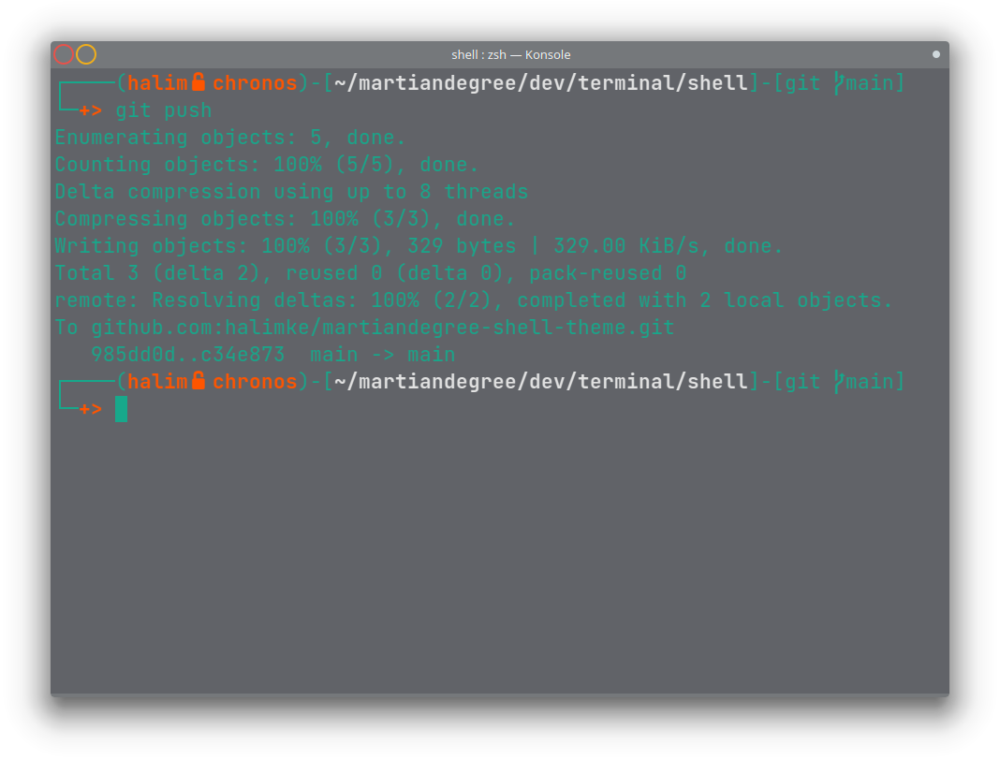
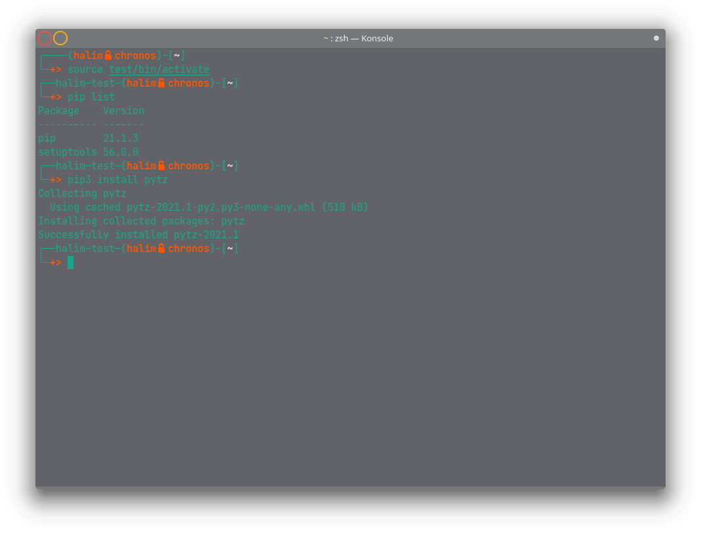
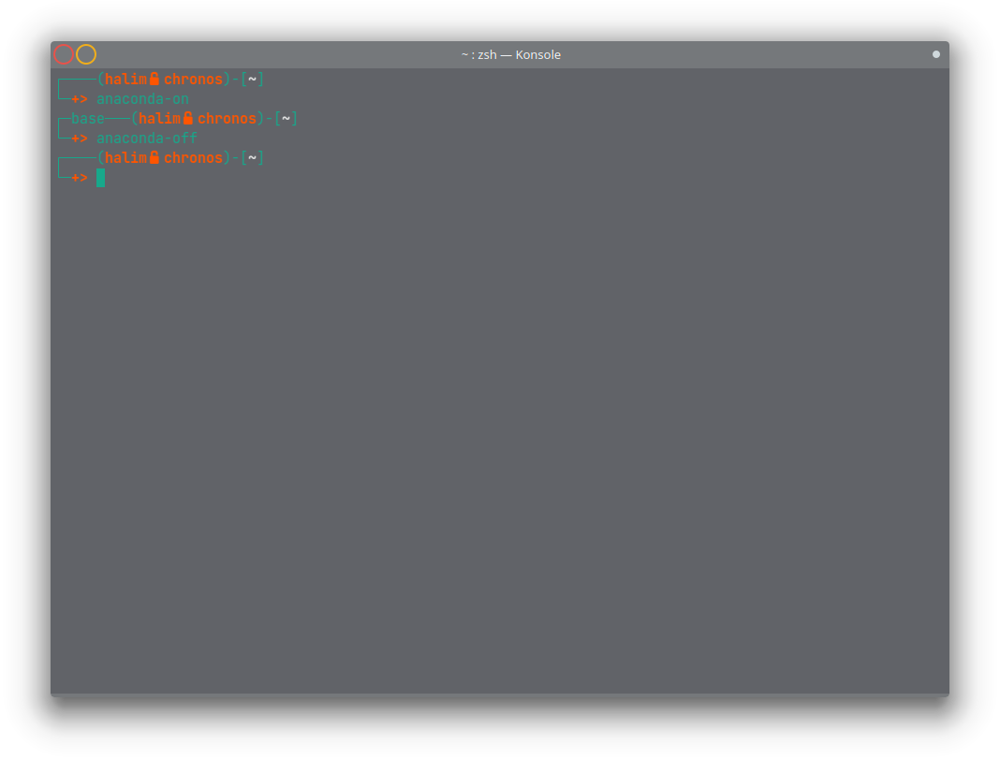

# M∆RͲI∆Ŋ° - zsh-theme
> Love your terminal and make it yours

## Table of contents
* [Screenshots](#screenshots)
* [Technologies](#technologies)
* [Setup](#setup)
* [Status](#status)
* [Inspiration](#inspiration)
* [Contact](#contact)

## Screenshots

## Technologies
* zsh - version 5.8

## Setup
Requirements before installing
1. zsh shell
2. oh-my-zsh
3. Jetbrains Mono powershell font

Installation is simple.
1. Clone the repository
2. Execute install.sh

## Status
Project is: _in progress_

## Inspiration
Project inspired by kali linux & based on frisk.zsh-theme

## Contact
Created by [@halim_ke](https://twitter.com/halim_ke) - on Twitter.
